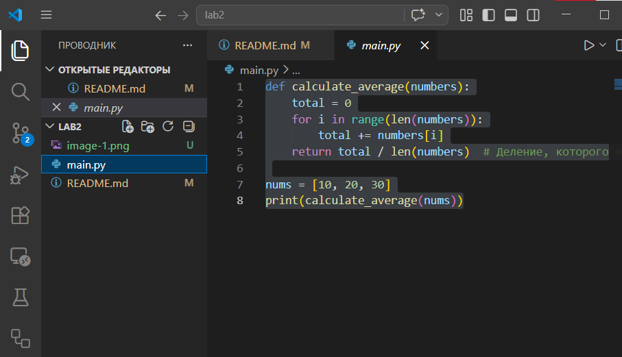
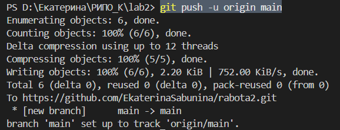
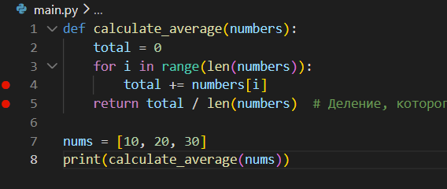
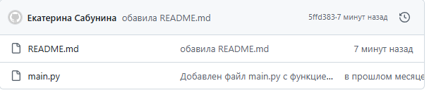

# Отчет по лабораторной работе №2

**Дисциплина:** Разработка инструментального программного обеспечения  
**Студентка:** Екатерина Сабынина  
**Группа:** 222  
**GitHub:** https://github.com/EkaterinaSabunina/rabota1

---

## 1. Цель работы

Научиться устанавливать, настраивать и использовать среду разработки (IDE) для создания инструментального программного обеспечения.

---

## 2. Задачи

- Выбрать и установить IDE.
- Настроить основные функции.
- Создать проект и протестировать отладку.
- Интегрировать проект с Git.

---

## 3. Выполненные операции

### 3.1 Выбор и настройка IDE

**Язык программирования:** Python  
**IDE:** Visual Studio Code  

**Установленные расширения:**  
- Python  
- Pylance  
- Python Debugger  

### 3.2 Создание проекта

Создана папка `lab2`, в ней файл `main.py` со следующим кодом:

python
def calculate_average(numbers):
    total = 0
    for i in range(len(numbers)):
        total += numbers[i]
    return total / len(numbers)

nums = [10, 20, 30]
print(calculate_average(nums)) 

### 3.3 Проверка функций редактора
Функция	Результат
Подсветка синтаксиса	✅ работает
Автодополнение кода	✅ работает
Переход к определению (F12)	✅ работает
Рефакторинг (F2)	✅ работает
### 3.4 Отладка программы
Установлена точка останова на строке с вычислением. Выполнено пошаговое выполнение (клавиша F10). В окне VARIABLES отслеживались значения переменных.

В результате отладки обнаружено, что функция calculate_average вычисляет среднее арифметическое. В коде это соответствует поставленной задаче.

### 3.5 Интеграция с Git
Выполнены команды:

bash
git init
git add main.py
git commit -m "Добавлен main.py"
git remote add origin https://github.com/EkaterinaSabunina/rabota1.git
git push -u origin main
Файл main.py успешно загружен в репозиторий на GitHub.

## 4. Скриншоты
Описание	Скриншот
Интерфейс VS Code с проектом	
Результат запуска программы
Отладка с точкой останова	
Страница GitHub с файлами	
### 5. Выводы
В ходе выполнения лабораторной работы я:

настроила Visual Studio Code для разработки на Python;

освоила основные функции редактора (подсветка, автодополнение, навигация);

научилась использовать отладчик для поиска ошибок;

закрепила навыки работы с Git (инициализация, коммит, отправка на GitHub).

Полученные навыки необходимы для дальнейшей эффективной разработки программного обеспечения.